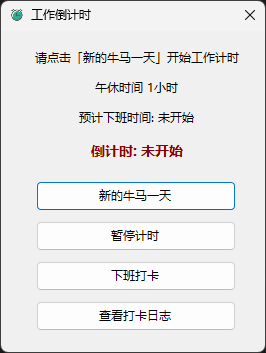

# 牛马打卡工具 🕐 WorkCountdown

一个贴心的桌面倒计时工具，帮你追踪工作时间，准时下班不再难！

## 主要功能 ✨

- **8小时智能倒计时** - 自动计算下班时间
- **午休时间扣除** - 12:00-13:00自动暂停计时
- **跨天自动重置** - 凌晨4点开启新的一天
- **打卡日志记录** - 完整记录上下班时间
- **系统托盘运行** - 最小化不占任务栏
- **下班提醒通知** - 准时提醒不加班

## 使用说明 📖

### 开始工作
1. 点击「新的牛马一天」开始计时
2. 程序自动计算8小时后的下班时间
3. 午休时间自动暂停，无需手动操作

### 下班打卡
1. 点击「下班打卡」记录下班时间
2. 系统会保存完整的工作记录
3. 可在日志中查看历史记录

### 日志管理
- 点击「查看日志」查看所有打卡记录
- 支持双击编辑时间数据
- 自动计算实际工作时长（已扣除午休）

## 技术特点 🔧

- 基于.NET WinForms开发
- 使用JSON文件本地存储数据
- 嵌入式资源图标，无需额外文件
- 支持高DPI显示适配

## 系统要求 💻

- Windows 7及以上系统
- .NET 6.0 Runtime

---

*README由AI辅助编写，如有描述不清之处请见谅* 🤖